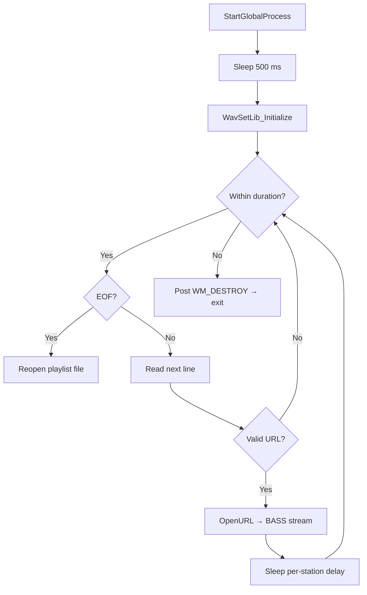

# Configuration Details – Station List and Timing

This section explains how the application reads a list of radio stations, controls playback timing, and sequences streams in a background thread.

---

## Station List File 🎵

Every run begins by loading a **station/playlist file** into an input stream:

- **Variable**
- `global_filename` defaults to `"radiostations.txt"`
- **Stream**
- `std::ifstream global_ifstream` opens `global_filename` for line-by-line reading

**Core snippet**:

```cpp
string global_filename = "radiostations.txt";
std::ifstream global_ifstream;
// …
global_ifstream.open(global_filename.c_str(), ios_base::in);
std::getline(global_ifstream, global_line);
```

---

## Playback Duration & Per-Station Delay ⏱️

Playback timing is fully configurable via two globals, overridable on the command line:

| Variable | Default | CLI Arg # | Purpose |
| --- | --- | --- | --- |
| ------------------------------------ | ---------: | ----------: | ------------------------------------------------ |
| **global_filename** | radiostations.txt | 1 | Path to station list file |
| **global_duration_sec** | 180.0 | 2 | Total playback duration (seconds) |
| **global_sleeptimeperstation_sec** | 30.0 | 3 | Time to remain on each station (seconds) |


**Override example in WinMain**:

```cpp
if(nArgs > 1) global_filename = szArgList[1];
if(nArgs > 2) global_duration_sec = atof(szArgList[2]);
if(nArgs > 3) global_sleeptimeperstation_sec = atof(szArgList[3]);
```

---

## Station Sequencing Thread 🧵

A dedicated thread runs `StartGlobalProcess`, which:

1. **Initial delay** – waits 500 ms
2. **Display init** – calls `WavSetLib_Initialize`
3. **Loop** while total runtime < `global_duration_sec`
4. Reopens file on EOF
5. Reads next line into `global_line`
6. If non-empty and valid URL:
7. Calls `OpenURL` (spawns BASS stream)
8. Sleeps `global_sleeptimeperstation_sec`
9. **Shutdown** – posts `WM_DESTROY` to exit

```cpp
void __cdecl StartGlobalProcess(void) {
    Sleep(500);
    WavSetLib_Initialize(...);
    DWORD now = GetTickCount();
    while( (global_duration_sec < 0.0f)
        || ((now - global_startstamp_ms)/1000.0f) < global_duration_sec ) {
        
        if(global_ifstream.eof()) {
            global_ifstream.close();
            global_ifstream.open(global_filename.c_str(), ios::in);
        }
        std::getline(global_ifstream, global_line);
        if(!global_line.empty()) {
            char* urlBuf = strdup(global_line.c_str());
            OpenURL(urlBuf);
            Sleep((int)(global_sleeptimeperstation_sec * 1000));
        }
        now = GetTickCount();
    }
    PostMessage(global_hwnd, WM_DESTROY, 0, 0);
}
```

### Flow of `StartGlobalProcess`



---

## Request Management & URL Buffer

To avoid race conditions when switching streams, the app uses:

- `**DWORD global_req**` – increments each request; only the latest stream is kept
- `**char global_url[1024]**` – buffer for URL before streaming

Inside `OpenURL`:

```cpp
r = ++global_req;                 // mark new request
BASS_StreamFree(global_chan);     // close old stream
StatusAddText("connecting.\n");
c = BASS_StreamCreateURL(url, 0, flags, StatusProc, (void*)r);
free(url);
if(r != global_req) {             // stale request?
    if(c) BASS_StreamFree(c);
    return;
}
global_chan = c;                  // current stream handle
SetTimer(global_hwnd, global_hwnd_timerid_prebuffermonitoring, 5, 0);
```

---

## Integration with Other Components

- **Spectrum Updates**: `UpdateSpectrum` timer (40 Hz) draws waveform/spectrum independently
- **Thread Safety**: `CRITICAL_SECTION global_lock` guards `global_req` updates
- **Clean Shutdown**: After total duration, `WM_DESTROY` triggers resource cleanup and optional `end.ahk` script

---

> **Key Takeaway** Flexible station sequencing is driven by three globals (`global_filename`, `global_duration_sec`, and `global_sleeptimeperstation_sec`), read from the command line or defaults, and executed in `StartGlobalProcess`, which coordinates file I/O, BASS streaming, timing, and graceful shutdown.