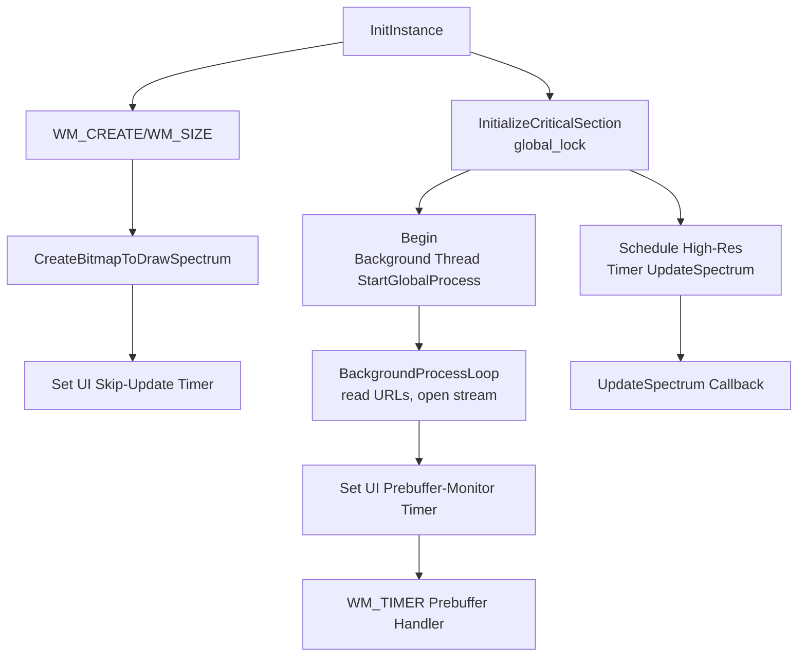

# Configuration Details – Timers and Threading

This section dives into how **spiradiospectrumplay24bitwin32** orchestrates its timing and threading to ensure smooth, real-time audio playback and visualization without blocking the UI. We cover:

- UI timers for bitmap reconfiguration and prebuffer monitoring
- A high-resolution multimedia timer for spectrum updates
- A background thread for streaming logic
- A critical section for safe shared-state access

---

## Overview Table

| Component | Identifier / Handle | Interval | Callback / Function | Purpose |
| --- | --- | --- | --- | --- |
| ⏳ UI Skip-Update Timer | `global_hwnd_timerid_skipupdatespectrum` | 5000 ms | `WM_TIMER` | Delay clearing `global_skip_updatespectrum` after bitmap resize |
| ⏳ UI Prebuffer-Monitor Timer | `global_hwnd_timerid_prebuffermonitoring` | 5 ms | `WM_TIMER` | Track BASS streaming buffer fill progress |
| ⏱️ High-Res Spectrum Timer | `global_timer_updatespectrum` | 25 ms | `UpdateSpectrum` | Drive real-time waveform/spectrum rendering |
| 🤖 Background Processing Thread | (returned by `_beginthread`) | N/A | `StartGlobalProcess` | Load URLs, switch stations, and update UI in background |
| 🔒 Critical Section | `global_lock` | N/A | N/A | Protects shared `global_chan` and `global_req` |


---

## UI Timers

Standard Win32 timers (`SetTimer` / `KillTimer`) control two key UI-thread events:

1. **Skip-Update Timer**
2. **When?** After recreating the spectrum bitmap to prevent drawing conflicts.
3. **How?**

```cpp
     // Stop any pending skip-update
     KillTimer(global_hwnd, global_hwnd_timerid_skipupdatespectrum);
     // Schedule a 5 s timeout to re-enable UpdateSpectrum
     SetTimer(global_hwnd, global_hwnd_timerid_skipupdatespectrum, 5000, 0);
```

- **What it does:** On WM_TIMER with `wParam == global_hwnd_timerid_skipupdatespectrum`, the handler clears `global_skip_updatespectrum`, allowing spectrum drawing to resume.

1. **Prebuffer-Monitor Timer**
2. **When?** Immediately after initiating a new stream URL.
3. **How?**

```cpp
     // Start frequent buffer-fill checks (every 5 ms)
     SetTimer(global_hwnd, global_hwnd_timerid_prebuffermonitoring, 5, 0);
```

- **What it does:** In the WM_TIMER handler, it queries `BASS_StreamGetFilePosition` to compute buffer fill percentage. Once prebuffering completes (> 75%), it kills this timer and displays stream metadata.

---

## High-Resolution Periodic Updates

To achieve smooth 40 Hz spectrum rendering, the application employs the Windows multimedia timer API (`timeSetEvent`):

```cpp
// Schedule UpdateSpectrum to fire every 25 ms (TIME_PERIODIC)
global_timer_updatespectrum = timeSetEvent(
    25,                      // delay in ms
    25,                      // resolution in ms
    (LPTIMECALLBACK)&UpdateSpectrum,
    0,
    TIME_PERIODIC
);
```

- **Callback:**

```cpp
  void CALLBACK UpdateSpectrum(UINT uTimerID, UINT uMsg, DWORD dwUser, DWORD dw1, DWORD dw2) { … }
```

- **Purpose:** Drives per-interval capture of audio levels and paints the 24-bit waveform/spectrum over the JPEG background.

---

## Background Processing Thread

A dedicated thread handles network I/O, playlist iteration, and stream switching without freezing the UI:

```cpp
// Initialize synchronization primitive
InitializeCriticalSection(&global_lock);
// Launch the streaming loop in a background thread
_beginthread(
    (void(__cdecl*)(void*)) StartGlobalProcess,
    0,
    0
);
```

- **Function:**

```cpp
  void __cdecl StartGlobalProcess(void) {
      Sleep(500);
      WavSetLib_Initialize( /* … */ );
      while (/* within duration */) {
          // Read next URL, open BASS stream, start prebuffer timer
      }
      PostMessage(global_hwnd, WM_DESTROY, 0, 0);
  }
```

- **Benefit:** Keeps audio setup, URL reads, and sleep loops off the main thread for responsive painting and input handling.

---

## Synchronization with Critical Section

The global `CRITICAL_SECTION global_lock` ensures that shared resources—especially `global_chan` (current BASS stream handle) and `global_req` (request counter)—are accessed safely across threads:

```cpp
// Protect update of the current stream handle
EnterCriticalSection(&global_lock);
    if (r != global_req) { /* discard */ }
    global_chan = c;
LeaveCriticalSection(&global_lock);
```

- **Why?** Prevents race conditions between the background thread creating streams and the UI timers querying or terminating them.
- **Initialization:**

```cpp
  InitializeCriticalSection(&global_lock);
```

- **Cleanup:**

On program exit, the OS reclaims OS-level locks; explicit `DeleteCriticalSection` is optional here.

---

## Architecture Flowchart



This diagram highlights the interplay between thread initialization, timer scheduling, and event callbacks that drive the core playback and visualization loop.