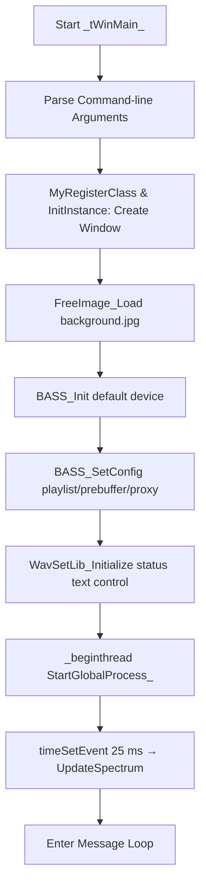

# Getting Started - First Run

This section guides you through the essential steps to launch the **SpiraRadioSpectrumPlay24bit** application for the first time. You’ll learn how to prepare required files, invoke the executable, and understand the core initialization workflow that powers the audio playback and real-time visualization.

## Prerequisites

- 🖼️ **Background Image**

A JPEG image named `background.jpg` must reside in the same folder as the built executable.

- 📻 **Radio Stations List**

If you intend to cycle through multiple streams, create a `radiostations.txt` file. By default, the application uses `"radiostations.txt"` as the source for station URLs.

- 💻 **Built Executable**

Ensure you have the Visual Studio–built `.exe` available in your working directory, along with all required DLLs (BASS, PortAudio, FreeImage, your WAV helper library).

---

## 1. Place the Background Image

The app uses **FreeImage** to load and render a static JPEG background behind the spectrum/waveform display.

| File Name | Purpose |
| --- | --- |
| `background.jpg` | Background for the main window canvas |


```cpp
// Load the JPEG at startup (in InitInstance)
global_dib = FreeImage_Load(FIF_JPEG, "background.jpg", JPEG_DEFAULT);
```

This call occurs before window creation to ensure the image is ready for drawing .

---

## 2. Prepare the Radio Stations List

To enable automatic station cycling:

1. Create a plain-text file named `radiostations.txt`.
2. List one stream URL or filename per line, for example:

```plaintext
   http://stream.example.com:8000/mystation
   C:\Music\playlist.m3u
```

1. The global processing thread will read this file in a loop, opening each URL in turn .

---

## 3. Run the Executable

Invoke the application from a command prompt. At minimum, supply one argument for the audio source:

```bash
SpiraRadioSpectrumPlay24bitWin32.exe "<audio_file_or_stream_URL>"
```

Additional optional parameters (in order) control:

- **Duration** (seconds)
- **Sleep time per station** (seconds)
- **Window position** (`x` `y`)
- **Window size** (`width` `height`)
- **Alpha transparency** (`0–255`)
- **Title bar** (`1` = show, `0` = hide)
- **Menu bar** (`1` = show, `0` = hide)
- **Accelerators** (`1` = enabled, `0` = disabled)
- **Font height** (pixels)
- **Custom window class** and **title** (wide strings)
- **Spectrum mode**, **band count**, **color settings**, etc.

For a full list of command-line arguments and their effects, see “Command-line Arguments and Configuration”.

---

## 4. Application Startup Workflow

When you launch the executable, the application executes a series of initialization steps to prepare audio playback, the GUI window, text rendering, and the real-time visualization.



- 🎨 **Load Background**

FreeImage loads `background.jpg` into `global_dib` for later blitting .

- 🔧 **Window Creation**

Registers the Win32 class, creates a layered window (with optional title/menu bars), and applies alpha transparency.

- 🔊 **Audio Device Initialization**

Calls `BASS_Init(-1,44100,0,hWnd,NULL)`.

Configures:

- Playlist processing (`BASS_CONFIG_NET_PLAYLIST, 1`)
- Pre-buffering behavior (`BASS_CONFIG_NET_PREBUF, 0`)
- Proxy settings (`BASS_CONFIG_PTR`) .
- 📝 **Text Rendering Setup**

Invokes `WavSetLib_Initialize` to attach a transparent static control for status messages (e.g., station names) .

- 🧵 **Global Processing Thread**

Spawns the `StartGlobalProcess` thread after a short delay; this thread reads `radiostations.txt`, opens each URL via `BASS_StreamCreateURL`, updates status text, and sleeps per station cycle time .

- ⏲️ **Spectrum Update Timer**

Schedules a periodic timer (`timeSetEvent(25,25,UpdateSpectrum,…)`) to refresh the 24-bit waveform/spectrum display at approximately 40 Hz .

```cpp
// Simplified InitInstance snippet
global_dib = FreeImage_Load(FIF_JPEG, "background.jpg", JPEG_DEFAULT);
if (!BASS_Init(-1, 44100, 0, hWnd, NULL)) return FALSE;
BASS_SetConfig(BASS_CONFIG_NET_PLAYLIST, 1);
BASS_SetConfig(BASS_CONFIG_NET_PREBUF, 0);
BASS_SetConfigPtr(BASS_CONFIG_NET_PROXY, global_proxy);
_beginthread(StartGlobalProcess, 0, 0);
global_timer_updatespectrum = timeSetEvent(25, 25, UpdateSpectrum, 0, TIME_PERIODIC);
```

By completing these steps, the application is ready to play audio streams/files and render a dynamic, 24-bit visual spectrum over your chosen JPEG background.