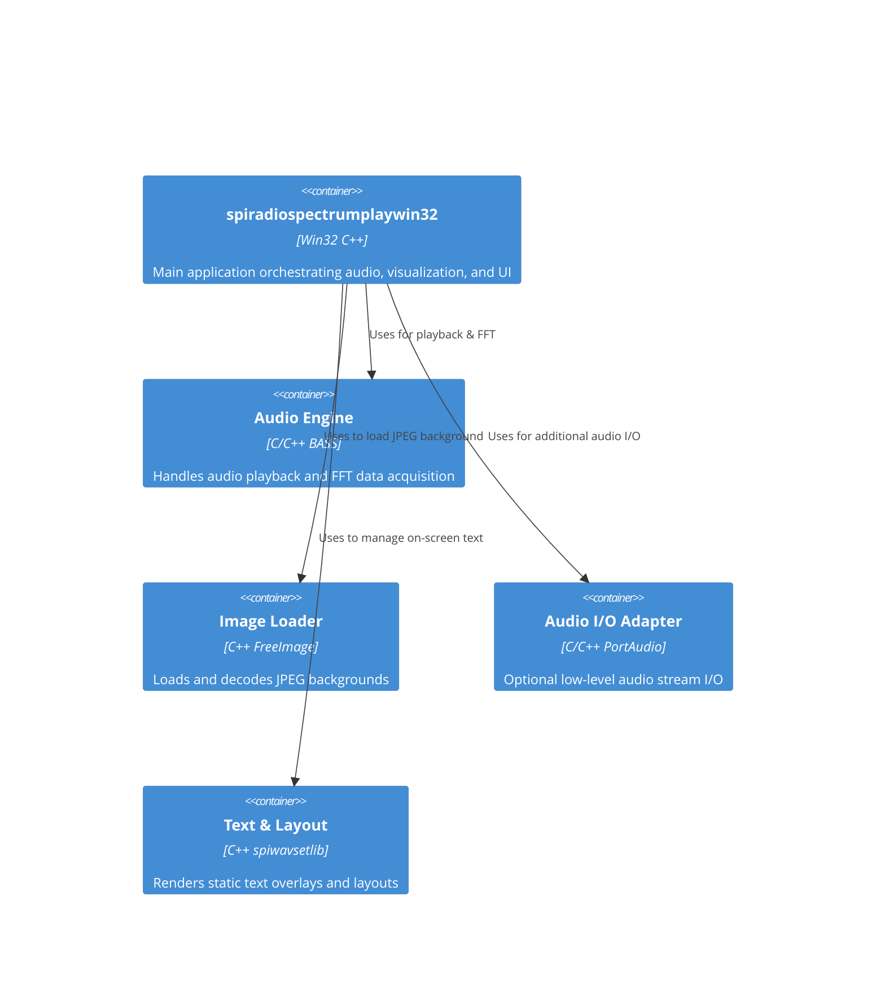

# Getting Started – Overview and Features

Welcome to **spiradiospectrumplaywin32**, a lightweight Win32 desktop application for audio playback and real-time visualization. This section introduces the application’s purpose, high-level architecture, and key capabilities. You will learn how components interact, which libraries power each feature, and how to tailor behavior via command-line parameters.

## Overview

**spiradiospectrumplaywin32** launches a resizable, layered Win32 window that:

- Plays local audio files or internet radio streams.
- Renders a live 24-bit waveform or spectrum overlay.
- Displays the visualization over a user-supplied JPEG background.
- Relies on command-line switches for full customization.

The app uses industry-standard libraries for audio and imaging, and a custom helper for static text layout.

## Architecture

The core application orchestrates playback, analysis, image loading, and UI rendering. It integrates four main components:



Each container communicates through well-defined C APIs. The main WinMain entry sets up these modules and starts timers for periodic spectrum updates.

## Key Components

Below is a summary of the libraries and their roles:

| Component | Role | Code Reference |
| --- | --- | --- |
| **BASS** | Audio playback, stream buffering, FFT data | `#include "bass.h"` |
| **FreeImage** | Load and decode JPEG into a 24-bit DIB section | `FreeImage_Load(FIF_JPEG, "background.jpg", …)` |
| **PortAudio** | Optional audio input/output integration (low-level stream reads) | Commented I/O via `Pa_ReadStream` |
| **spiwavsetlib** | Static text creation and layout within the Win32 window | `WavSetLib_Initialize(...)` |
| **Win32 API** | Window creation, message loop, painting, timers | Entry in `_tWinMain` and `WndProc` |


## Features

spiradiospectrumplaywin32 offers a rich feature set to customize both audio and visuals:

- 🎵 **Flexible Playback**

Play local files or internet streams with buffering and metadata support.

- 🌊 **Real-Time Waveform & Spectrum**

Choose among multiple visualization modes (linear, logarithmic, waveform).

- 🖼️ **Custom JPEG Background**

Overlay animations on any static image via FreeImage.

- 🌈 **24-Bit Full-Color Render**

Render spectrum bars or waveform in full RGB.

- ⚙️ **Command-Line Configuration**

Fine-tune window geometry, transparency, fonts, colors, bands, and more.

## Command-Line Configuration

All settings are specified at launch. Below is a parameter reference:

| Position | Switch | Description | Default |
| --- | --- | --- | --- |
| 1 | `<stations.txt>` | Path to playlist or station list | `"radiostations.txt"` |
| 2 | `<duration_sec>` | Duration to play each station (seconds) | `180.0` |
| 3 | `<sleep_sec>` | Silence between stations (seconds) | `30.0` |
| 4 | `<x>` | Window X coordinate | `100` |
| 5 | `<y>` | Window Y coordinate | `200` |
| 6 | `<width>` | Window width (pixels) | `400` |
| 7 | `<height>` | Window height (pixels) | `400` |
| 8 | `<alpha>` | Window transparency (0–255) | `200` |
| 9 | `<titlebar>` | Show title bar (1 = yes, 0 = no) | `1` |
| 10 | `<menubar>` | Show menu bar (1 = yes, 0 = no) | `1` |
| 11 | `<accelerator>` | Enable keyboard accelerators (1 = yes, 0 = no) | `0` |
| 12 | `<font_height>` | Font size for static text | `24` |
| 13 | `<window_class>` | Custom window class name | `"spiradio"` |
| 14 | `<window_title>` | Custom window title | `"spiradiospectrumplaywin32"` |
| 15 | `<start_cmd>` | Shell command to execute at launch (optional) | `""` |
| 16 | `<end_cmd>` | Shell command to execute on exit (optional) | `""` |
| 17 | `<spec_mode>` | Visualization mode (0=FFT, 3=waveform, others up to 18) | `4` |
| 18 | `<bands>` | Number of frequency bands for spectrum modes | `20` |
| 19–21 | `<bg_R> <bg_G> <bg_B>` | Background solid color, RGB components | `127 0 127` |
| 22–24 | `<c1_R> <c1_G> <c1_B>` | Channel 1 color, RGB components | `255 0 0` |
| 25–27 | `<c2_R> <c2_G> <c2_B>` | Channel 2 color, RGB components | `0 0 255` |


 .

### Example Invocation

```bash
spiradiospectrumplaywin32.exe \
  stations.txt 180 30 100 200 800 600 200 \
  1 1 0 24 MyClass "My Spectrum Player" \
  "" "" 4 32 \
  50 50 50  0 255 0  0 0 255
```

This command:

1. Loads `stations.txt` and plays each station for 180 seconds.
2. Pauses 30 seconds between stations.
3. Opens a 800×600 window at (100, 200) with α=200.
4. Shows title and menu bars; font size = 24.
5. Uses custom window class `MyClass`.
6. Sets spectrum mode 4 with 32 bands.
7. Uses dark gray background; green for channel 1; blue for channel 2.

---

Start exploring the many visualization options and tailor colors, text, and layout to your taste. Enjoy building your own immersive audio-visual experience!