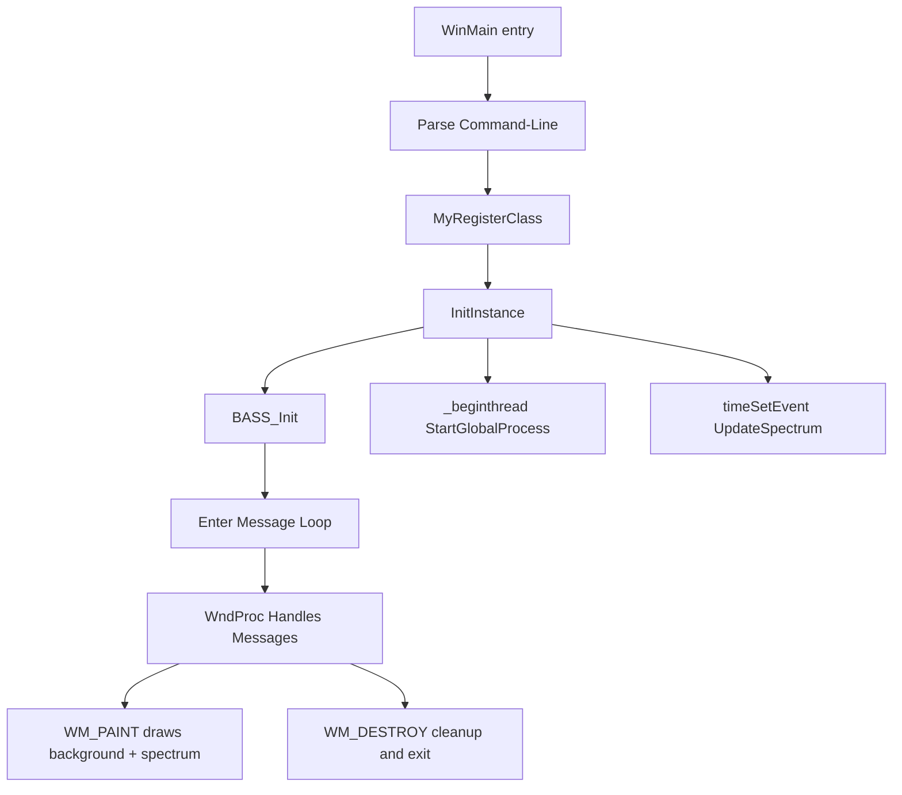

# Project Structure and Extensibility – Core Source Files

This section explains the **key source files** driving the application’s startup, rendering, and cleanup logic. Each file’s purpose, relationships, and extensibility points are detailed below.

| File | Purpose |
| --- | --- |
| 🎯 **spiradiospectrumplaywin32.cpp** | Main application logic: entry point, window creation, audio init, rendering and message loop |
| 📑 **spiradiospectrumplaywin32.h** | Resource identifiers, forward declarations, and GPL license header |
| 🔧 **stdafx.h / stdafx.cpp** | Precompiled headers for Windows API, CRT, third-party libraries |
| ⚙️ **targetver.h** | Defines the highest Windows SDK version via `SDKDDKVer.h` |
| 🎨 **spiradiospectrumplaywin32.rc** | Resource script: dialogs, icons, string tables (e.g., `IDS_APP_TITLE`) |
| 📓 **Resource.h** | Numeric identifiers for menus, dialogs, icons, controls |


---

## spiradiospectrumplaywin32.cpp 🎯

This is the **heart** of the application. It orchestrates:

- Command-line parsing and global parameter setup
- Window class registration (`MyRegisterClass`) and creation (`InitInstance`)
- BASS audio engine initialization and configuration
- Launching a **background thread** for station processing (`StartGlobalProcess`)
- Setting up a **periodic timer** to invoke `UpdateSpectrum` for real-time rendering
- Implementing `WndProc` to handle painting, input, and cleanup

```cpp
int APIENTRY _tWinMain(
    HINSTANCE hInstance, HINSTANCE, LPTSTR lpCmdLine, int nCmdShow
){
    // Parse args: station list, duration, window geometry, alpha...
    _beginthread(StartGlobalProcess, 0, 0);
    global_timer_updatespectrum = timeSetEvent(
        25, 25, (LPTIMECALLBACK)&UpdateSpectrum, 0, TIME_PERIODIC
    );
    // Main message loop...
}
```

Key extensibility points:

- `**specmode**`** selection** via mouse buttons (cycles rendering modes)
- **Global parameters** exposed through command-line arguments (e.g., `global_alpha`)
- **Thread entry** (`StartGlobalProcess`) can be swapped with custom logic

---

## spiradiospectrumplaywin32.h 📑

This header declares resources and core functions:

```cpp
#pragma once
#include "resource.h"

// Forward declarations:
ATOM                MyRegisterClass(HINSTANCE);
BOOL                InitInstance(HINSTANCE, int);
LRESULT CALLBACK    WndProc(HWND, UINT, WPARAM, LPARAM);
INT_PTR CALLBACK    About(HWND, UINT, WPARAM, LPARAM);
```

- **Resource inclusion**: ensures `IDD_ABOUTBOX`, `IDS_APP_TITLE`, etc., match the compiled `.rc`
- **GPL license block** at the top guards reuse

---

## stdafx.h / stdafx.cpp 🔧

Provides **precompiled headers** to speed up builds:

```cpp
// stdafx.h
#pragma once
#include "targetver.h"
#define WIN32_LEAN_AND_MEAN
#include <windows.h>
#include <stdlib.h>
#include <malloc.h>
#include <memory.h>
#include <tchar.h>
```

```cpp
// stdafx.cpp
#include "stdafx.h"
// (No additional content to ensure PCH covers all heavy headers)
```

- Centralizes **Windows API** and **CRT** includes
- Reduces compile times by grouping rarely-changed headers

---

## targetver.h ⚙️

Sets the **target Windows platform**:

```cpp
#pragma once
// Defines highest available Windows platform.
#include <SDKDDKVer.h>
```

- Include `**SDKDDKVer.h**` by default
- To support older Windows, insert `#include <WinSDKVer.h>` and redefine `_WIN32_WINNT` before it

---

## spiradiospectrumplaywin32.rc 🎨

Resource script defining:

- **Icons** (`IDI_SPIWAVWIN32`, `IDI_SMALL`)
- **Dialogs** (`IDD_ABOUTBOX`)
- **String table** entries (`IDS_APP_TITLE` = "spiradiospectrumplaywin32")

```rc
STRINGTABLE
BEGIN
    IDS_APP_TITLE    "spiradiospectrumplaywin32"
    IDC_SPIWAVWIN32  "SPIRADIOSPECTRUMPLAYWIN32"
END
```

Use **FreeImage** to load `background.jpg`, then `StretchDIBits` it each `WM_PAINT` .

---

## Resource.h 📓

Defines **numeric IDs** used across the GUI:

```c
#define IDD_SPIWAVWIN32_DIALOG 102
#define IDS_APP_TITLE          103
#define IDC_SPIWAVWIN32        109
#define IDC_STATIC             -1
```

- Ensures **consistency** between `.rc` and code
- Update here to add new controls or dialogs

---

## Application Startup Flow



This diagram highlights the **startup sequence** and **cleanup path**, showing how command-line inputs cascade into rendering and threading.

---

By understanding each core file’s role and how they interconnect, developers can **extend**:

- Add new **spectrum modes** in `UpdateSpectrum`
- Modify **threaded processing** in `StartGlobalProcess`
- Enhance **resource scripts** for richer UI
- Adjust **precompiled headers** for additional libraries

This modular structure facilitates maintainability and rapid feature growth.