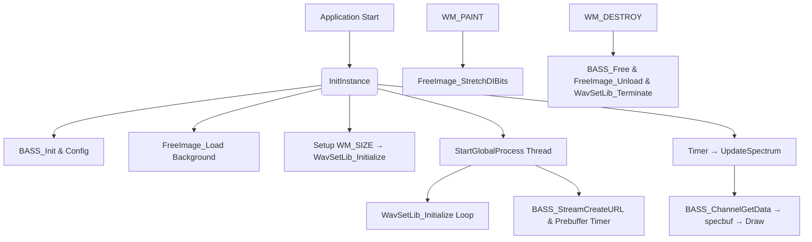

# Project Structure and Extensibility – External Libraries and Integration Points

This section describes how the application integrates with key third-party libraries and where developers can extend functionality. Each library serves a distinct purpose—from audio playback to background rendering—while offering clear integration points for future enhancements.

---

## External Libraries Overview

| Library | Purpose | Key Functions / APIs | Extension Points |
| --- | --- | --- | --- |
| 🎵 **BASS** | Audio playback, streaming, FFT analysis | `BASS_Init`, `BASS_SetConfig`, `BASS_StreamCreateURL`,<br/>`BASS_ChannelIsActive`, `BASS_ChannelGetData` | • Add recording via `BASS_RecordInit` / `BASS_RecordStart`<br/>• Support custom FFT sizes (`BASS_DATA_FFT2048`, `BASS_DATA_FFT4096`, etc.)<br/>• Expose additional network settings (buffering, proxy) |
| 🛠 **PortAudio** | Alternative audio I/O | `Pa_ReadStream` (commented out) | • Re-enable live microphone input<br/>• Integrate alternative FFT pipelines using `fft()` |
| 🖼 **FreeImage** | JPEG background loading & drawing | `FreeImage_Load`, `FreeImage_GetWidth`, `FreeImage_GetBits`,<br/>`FreeImage_Unload` | • Support multiple/dynamic backgrounds<br/>• Swap images at runtime based on user input or streams |
| ✉️ **spiwavsetlib** | Text overlay and metadata display | `WavSetLib_Initialize`, `WavSetLib_Terminate` | • Customize textual content (styles, fonts)<br/>• Integrate ICEcast/ICY metadata into overlays<br/>• Replace library with custom subtitle engine |


---

## 🎵 BASS: Audio Playback and Analysis

BASS drives core audio functionality: streaming, decoding, playback and real-time FFT analysis.

- **Initialization & Configuration**

```cpp
  // In InitInstance
  if (!BASS_Init(-1, 44100, 0, hWnd, NULL)) return FALSE;
  BASS_SetConfig(BASS_CONFIG_NET_PLAYLIST, 1);
  BASS_SetConfig(BASS_CONFIG_NET_PREBUF, 0);
  BASS_SetConfigPtr(BASS_CONFIG_NET_PROXY, global_proxy);
```

- **Spectrum & Waveform Data**

```cpp
  // In UpdateSpectrum callback
  DWORD state = BASS_ChannelIsActive(global_chan);
  if (state == BASS_ACTIVE_PLAYING) {
      float fft[2048];
      BASS_ChannelGetData(global_chan, fft, BASS_DATA_FFT2048);
      // Process fft[] into specbuf[]
  }
```

- **Extension Ideas**
- Recording support with `BASS_RecordInit` and `BASS_RecordStart`.
- Expose configurable FFT resolutions (e.g. 1024, 4096).
- Advanced network controls: reconnect logic, adaptive buffering.

---

## 🛠 PortAudio: Alternative FFT Source

PortAudio is included but currently unused in the visualization core. Commented code indicates experimental FFT from live streams.

```cpp
// Experimental PortAudio input
// global_err = Pa_ReadStream(global_stream, buf2, samples);
// fft(buf2, fftbuf, 1024);
```

**Future Work**

- Re-enable microphone or line-in input.
- Feed live data into existing FFT–render pipeline.
- Offer a “live input” visualization mode.

---

## 🖼 FreeImage: Background Rendering

FreeImage handles loading and cleanup of the JPEG background.

- **Loading**

```cpp
  global_dib = FreeImage_Load(FIF_JPEG, "background.jpg", JPEG_DEFAULT);
```

- **Drawing**

```cpp
  StretchDIBits(
    hdc, 0,0, global_imagewidth, global_imageheight,
    0,0,
    FreeImage_GetWidth(global_dib),
    FreeImage_GetHeight(global_dib),
    FreeImage_GetBits(global_dib),
    FreeImage_GetInfo(global_dib),
    DIB_RGB_COLORS, SRCCOPY
  );
```

- **Cleanup**

```cpp
  FreeImage_Unload(global_dib);
```

**Extension Ideas**

- Support multiple backgrounds selectable at runtime.
- Animate or transition between images.
- Cache backgrounds for performance.

---

## ✉️ spiwavsetlib: Text Overlay Management

The custom WAV helper library manages dynamic text overlays (e.g., station name, status).

- **Initialization on Resize**

```cpp
  WavSetLib_Initialize(
    global_hwnd, IDC_MAIN_STATIC,
    global_staticwidth, global_staticheight,
    global_fontwidth, global_fontheight,
    global_staticalignment
  );
```

- **Termination on Exit**

```cpp
  WavSetLib_Terminate();
```

**Customization Points**

- Modify library to fetch and display ICY metadata directly.
- Change font styles, colors, alignment logic.
- Replace with third-party subtitle or caption engine.

---

## Integration Flow



This flowchart highlights the lifecycle and integration points of each library.

---

> 💡 **Key Takeaway** The modular integration of BASS, PortAudio, FreeImage, and spiwavsetlib provides a robust foundation. Developers can **extend audio sources**, **customize visual backgrounds**, and **enhance text overlays** by leveraging and expanding these interfaces.