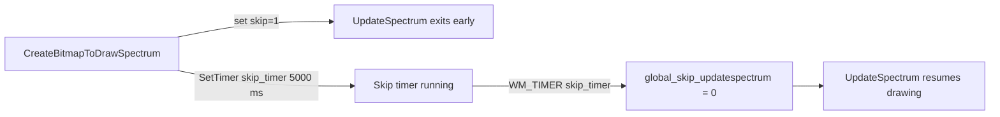

# Troubleshooting and FAQs – No Audio or Visualization Frozen

Experiencing silence or a frozen waveform/spectrum? This guide helps you pinpoint and resolve the most common issues when the application fails to play audio or update the visualization.

---

## 1. Invalid or Missing Input File/URL

Ensure the app has a **valid audio source**:

- By default, the app uses

```cpp
  string global_filename = "radiostations.txt";
```

- When you supply a command-line argument, it overrides this default:

```cpp
  if (nArgs > 1) {
      global_filename = szArgList[1];
  }
```

**Steps to verify:**

1. Run the app with your audio file or stream URL as the **first** argument:

```bash
   spiradiospectrumplay24bitwin32_vs2026.exe "C:\Music\track.mp3"
```

1. If omitted, confirm that `radiostations.txt` exists in the working folder and contains **one valid URL per line**.
2. Check file permissions and ensure the URL is reachable (try opening it in a browser).

---

## 2. Stream Not Active (BASS State)

The visualization updates only when BASS reports that the stream is playing. In **UpdateSpectrum**:

```cpp
void CALLBACK UpdateSpectrum(...){
    if (global_skip_updatespectrum) return;
    DWORD state = BASS_ChannelIsActive(global_chan);
    if (state == BASS_ACTIVE_PLAYING) {
        // draw waveform or spectrum…
    }
    // else: no drawing, so screen remains static
}
```

**What to check:**

- Confirm `BASS_Init` succeeded (no error on startup).
- Inspect any error callbacks (e.g., `BASS_StreamCreateURL` failure).
- Use `BASS_ChannelIsActive(global_chan)` in a small test harness to verify your stream URL actually plays.

---

## 3. Visualization Timer Paused (global_skip_updatespectrum)

When the app resizes or recreates bitmaps, it temporarily **pauses** updates via the `global_skip_updatespectrum` flag:

| Variable | Purpose | Reset Trigger |
| --- | --- | --- |
| **global_skip_updatespectrum** | Prevents drawing during bitmap recreation | WM_TIMER for skip-updatespectrum fires |
| **global_hwnd_timerid_skipupdatespectrum** | Timer ID used to clear the skip flag after delay | Set by `CreateBitmapToDrawSpectrum` (5 sec) |


### Bitmap Recreation Flow



### Key Code Snippets

```cpp
// Called when window resizes or at startup
void CreateBitmapToDrawSpectrum(){
    global_skip_updatespectrum = 1;
    Sleep(25);
    InvalidateRect(global_hwnd, NULL, FALSE);
    // … (delete old bitmap/DC, create new ones)
    SetTimer(global_hwnd,
             global_hwnd_timerid_skipupdatespectrum,
             5000, 0);
}
```

```cpp
// In WndProc: clear skip flag
case WM_TIMER:
    if (wParam == global_hwnd_timerid_skipupdatespectrum) {
        global_skip_updatespectrum = 0;
        KillTimer(global_hwnd, global_hwnd_timerid_skipupdatespectrum);
    }
    break;
```

**Troubleshooting Tips:**

- If the visualization never resumes, verify your window message loop processes `WM_TIMER`.
- Ensure no other timer IDs collide with `global_hwnd_timerid_skipupdatespectrum`.
- Confirm `CreateBitmapToDrawSpectrum` is actually called (check logs or add debug output).

---

## 4. Quick FAQ

🛠️ **Q: The app launches but remains silent—what now?**

**A:**

- Check that BASS initialized successfully.
- Verify your input file/URL is correct (see Section 1).
- Look at console or MessageBox errors from BASS (e.g., network or codec issues).

🎨 **Q: The background JPEG loads, but the spectrum never moves.**

**A:**

- Confirm `UpdateSpectrum` timer is running (`timeSetEvent` fires every 25 ms).
- If `global_skip_updatespectrum` stays at 1, inspect your WM_TIMER handler (Section 3).

💡 **Q: Can I debug the stream activity?**

**A:**

- Insert logs around `BASS_ChannelIsActive(global_chan)`.
- Use a simple BASS test program to isolate network vs. rendering issues.

---

By following these checks and understanding the interplay of **command-line parameters**, **BASS playback state**, and **update timers**, you can resolve most cases of “no audio” or a frozen visualization.