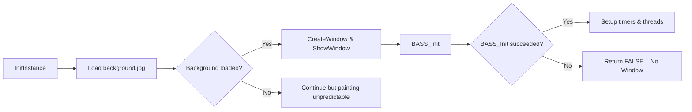

# Troubleshooting and FAQs – No Window or Crashes on Startup

Even a correctly built executable may fail to display its window or crash immediately on launch. This section helps you diagnose and resolve the most common startup issues.

---

## 1. Missing Dependent Libraries 🧩

The application links against several native libraries. If any are missing at build or runtime, the executable may fail silently or crash.

**Check your Visual Studio **`**.vcxproj**`** for the **`**AdditionalDependencies**`**:**

```xml
<AdditionalDependencies>
  .\lib-src\freeimage_vs2026\Dist\x32\FreeImage.lib;
  winmm.lib;
  \spiwavsetlib_vs2026u\Debug\spiwavsetlib_vs2019.lib;
  \lib-src\portaudio-2021\portaudio_vs2026\build\msvc\Win32\Debug\portaudio_x86.lib;
  \lib-src\bass24\c\bass.lib;
  Shlwapi.lib;
  %(AdditionalDependencies)
</AdditionalDependencies>
```

| Library | Purpose |
| --- | --- |
| FreeImage.lib | JPEG background loading |
| bass.lib | BASS audio engine initialization |
| portaudio_x86.lib | Low-latency audio I/O |
| spiwavsetlib_vs2019.lib | Custom WAV helper for text rendering |
| winmm.lib | Windows multimedia (timer, audio fallback) |
| Shlwapi.lib | Shell API (URL parsing, file helpers) |


**Solution**

- Ensure each `.lib` path is valid under both **Debug** and **Release** configurations.
- Re-run **Rebuild Solution** to catch missing link-time errors.

---

## 2. Missing `background.jpg` 📷

On startup, the app immediately loads a JPEG for the window background:

```cpp
global_dib = FreeImage_Load(FIF_JPEG, "background.jpg", JPEG_DEFAULT);
```

- If `background.jpg` is not in the working directory, `FreeImage_Load` returns `NULL`.
- Subsequent calls to `FreeImage_GetBits` or `FreeImage_GetWidth` on a `NULL` handle will crash.

**Checklist**

- Place `background.jpg` alongside the executable or set the working directory accordingly.
- Verify read permissions and correct filename casing on case-sensitive file systems.

---

## 3. BASS Audio Initialization Failure 🔊

If the BASS engine fails to initialize, the application aborts window creation:

```cpp
if (!BASS_Init(-1, 44100, 0, hWnd, NULL)) {
    // Initialization failed
    return FALSE;
}
```

- A return value of `FALSE` from `InitInstance` prevents the main window from appearing.
- Common causes: no default audio device, drivers in use by another process, or insufficient permissions.

**Troubleshooting Steps**

1. Open **Sound Settings** and confirm at least one playback device is enabled.
2. Update or reinstall audio drivers.
3. Run the application as **Administrator** to rule out permission issues.

---

## 4. Startup Flow Overview

This flowchart outlines the key startup steps and decision points:



---

## 5. Quick FAQ

- **Q:** The exe launches but no window appears.

**A:** Check the return value of `InitInstance`; likely **BASS_Init** failed or window handle creation returned `NULL`.

- **Q:** Application crashes with an access violation in painting code.

**A:** Ensure `global_dib` from `FreeImage_Load` is valid. Missing `background.jpg` is often the culprit.

- **Q:** Linker errors about undefined symbols in FreeImage or BASS.

**A:** Confirm `.lib` files are correctly referenced in both Debug and Release `AdditionalDependencies`.

---

**Keep this guide handy** whenever encountering silent failures or immediate crashes on startup. Properly configured libraries, assets, and devices are essential for a successful launch.