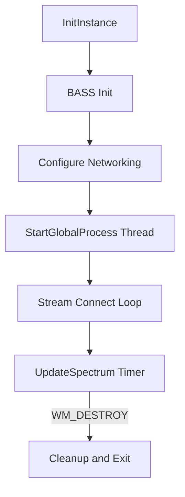

# Using the Application – Audio Playback Behavior

This section describes how the application initializes audio, configures network/stream options, acquires data for real-time visualization, and cleans up resources on shutdown. It explains the sequence of calls, their purpose, and how they interact with other components.

## Initialization of the Audio Subsystem 🎵

On startup, the application creates its main window and then initializes BASS to handle playback via the default output device at 44.1 kHz:

```cpp
// After creating and showing the window (hWnd):
if (!BASS_Init(-1, 44100, 0, hWnd, NULL)) {
    // Handle initialization failure...
    return FALSE;
}
```

- **BASS_Init**
- Device: `-1` (default)
- Sample rate: `44100` Hz
- Flags: `0`
- Window handle: `hWnd` (for deferred initialization messages)
- GUID: `NULL` (no specific device)

## Network and Stream Configuration 🌐

Immediately after `BASS_Init`, the application sets up streaming options to control playlist handling, buffering, and proxy usage:

| Configuration Flag | Description |
| --- | --- |
| `BASS_CONFIG_NET_PLAYLIST, 1` | Enable playlist processing |
| `BASS_CONFIG_NET_PREBUF, 0` | Disable automatic pre-buffering |
| `BASS_CONFIG_NET_PROXY, global_proxy` | Assign an HTTP proxy (if provided) |


```cpp
// Enable playlist parsing
BASS_SetConfig(BASS_CONFIG_NET_PLAYLIST, 1);

// Turn off automatic pre-buffering
BASS_SetConfig(BASS_CONFIG_NET_PREBUF, 0);

// Use a custom HTTP proxy string
BASS_SetConfigPtr(BASS_CONFIG_NET_PROXY, global_proxy);
```

These settings let the application manage connection logic and display buffering progress itself.

## Background Processing Thread 🧵

To avoid blocking the UI, stream connection and station-rotation logic run in a separate thread. This background thread handles reading URLs from the input list, connecting to streams, and invoking playback:

```cpp
// Launch StartGlobalProcess on its own thread
_beginthread((void(__cdecl*)(void*))StartGlobalProcess, 0, 0);
```

- **StartGlobalProcess**
- Sleeps briefly to allow initialization
- Calls `WavSetLib_Initialize` to prepare text helpers
- Reads station URLs in a loop based on `global_duration_sec`
- Posts `WM_DESTROY` when the playlist completes

## Real-Time Visualization Data Acquisition 📊

The application drives its waveform and spectrum display via a high-frequency timer (`UpdateSpectrum`). Depending on the selected mode, it uses either:

1. **Time-domain sample data**

```cpp
   BASS_ChannelGetData(
     global_chan,
     buf,
     (ci.chans * SPECWIDTH * sizeof(float)) | BASS_DATA_FLOAT
   );
```

- Floating-point samples avoid extra conversion
- Drawn as waveform traces

1. **Frequency-domain FFT data**

```cpp
   if (SPECWIDTH < 2048)
     BASS_ChannelGetData(global_chan, fft, BASS_DATA_FFT2048);
   else
     BASS_ChannelGetData(global_chan, fft, BASS_DATA_FFT4096);
```

- Returns 1024 or 2048 frequency bins
- Used for spectrum bar/line plots

## Shutdown and Cleanup 🛑

When the main window receives `WM_DESTROY`, the application tears down all subsystems in reverse order:

| Resource | Cleanup Call |
| --- | --- |
| Update timers | `timeKillEvent`, `KillTimer` |
| Spectrum DC / bitmap | `DeleteDC`, `DeleteObject` |
| WAV helper library | `WavSetLib_Terminate()` |
| Background image (DIB) | `FreeImage_Unload(global_dib)` |
| Custom font | `DeleteObject(global_hFont)` |
| BASS engine | `BASS_Free()` |
| Optional end script | `ShellExecuteA(NULL, "open", global_end.c_str(), ...)` |


```cpp
case WM_DESTROY: {
    // Stop spectrum updates
    if (global_timer_updatespectrum)
      timeKillEvent(global_timer_updatespectrum);

    // Release drawing objects
    if (specdc)       DeleteDC(specdc);
    if (specbmp)      DeleteObject(specbmp);

    // Terminate helpers
    WavSetLib_Terminate();

    // Stop global process timer
    if (global_timer)
      timeKillEvent(global_timer);

    // Unload background image
    FreeImage_Unload(global_dib);

    // Delete custom font
    DeleteObject(global_hFont);

    // Free BASS resources
    BASS_Free();

    // Optionally launch end script
    if (!global_end.empty())
      ShellExecuteA(NULL, "open", global_end.c_str(), "", NULL, SW_SHOWNORMAL);

    PostQuitMessage(0);
} break;
```

These steps ensure no resource leaks and allow an optional “cleanup” script (`global_end`) to run after exit.

---

