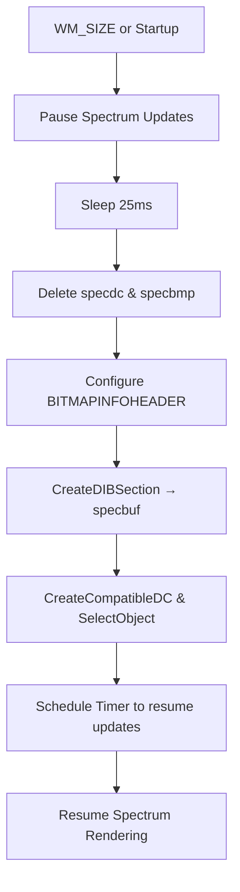

# Visualization Modes and Graphics – Bitmap Creation and Resizing

This section explains how the application prepares and maintains the Device Independent Bitmap (DIB) used for real-time spectrum rendering. It covers the **CreateBitmapToDrawSpectrum** function’s responsibilities and how **WM_SIZE** handles resizing to ensure the waveform/spectrum scales smoothly with the window.

---

## CreateBitmapToDrawSpectrum 🎨

**CreateBitmapToDrawSpectrum** manages the lifecycle of the spectrum bitmap and its memory DC, guaranteeing safe updates and proper resizing.

```cpp
void CreateBitmapToDrawSpectrum() {
    // 1. Pause spectrum updates
    global_skip_updatespectrum = 1;
    Sleep(25);  // wait for any in-flight UpdateSpectrum callback

    // 2. Clean up existing GDI objects
    if (specdc)   DeleteDC(specdc);
    if (specbmp)  DeleteObject(specbmp);

    // 3. Prepare BITMAPINFOHEADER for a 24-bit RGB DIB
    BYTE data[2000] = {0};
    BITMAPINFOHEADER* bh = (BITMAPINFOHEADER*)data;
    bh->biSize       = sizeof(*bh);
    bh->biWidth      = SPECWIDTH;
    bh->biHeight     = SPECHEIGHT;          // positive: bottom-up coordinate
    bh->biSizeImage  = SPECWIDTH * SPECHEIGHT * 3;
    bh->biPlanes     = 1;
    bh->biCompression= BI_RGB;
    bh->biBitCount   = 24;
    bh->biClrUsed    = 0;
    bh->biClrImportant = 0;

    // 4. Allocate pixel buffer and create memory DC
    specbmp = CreateDIBSection(
        0,
        (BITMAPINFO*)bh,
        DIB_RGB_COLORS,
        (void**)&specbuf,
        NULL,
        0
    );
    specdc = CreateCompatibleDC(0);
    SelectObject(specdc, specbmp);

    // 5. Resume spectrum updates after a delay
    if (global_titlebardisplay == 0)
        global_skip_updatespectrum = 0;
    KillTimer(global_hwnd, global_hwnd_timerid_skipupdatespectrum);
    SetTimer(global_hwnd, global_hwnd_timerid_skipupdatespectrum, 5000, 0);

    return;
}
```

### Steps Overview

- **Pause Updates**: Set `global_skip_updatespectrum=1` and `Sleep` to prevent concurrent drawing.
- **Resource Cleanup**: Delete any existing `specdc` (memory DC) and `specbmp` (bitmap).
- **Header Setup**: Populate a `BITMAPINFOHEADER` for 24-bit RGB with dimensions `SPECWIDTH×SPECHEIGHT`.
- **DIB Allocation**: Call `CreateDIBSection` to get a pixel buffer pointer in `specbuf`.
- **DC Creation**: Create a compatible DC (`specdc`) and select the new bitmap into it.
- **Resume Timer**: Clear `global_skip_updatespectrum` via a timer (`global_hwnd_timerid_skipupdatespectrum`) to safely restart `UpdateSpectrum`.

### BITMAPINFOHEADER Configuration

| Field | Value | Notes |
| --- | --- | --- |
| `biSize` | `sizeof(BITMAPINFOHEADER)` | Header size |
| `biWidth` | `SPECWIDTH` | Must be a multiple of 4 pixels |
| `biHeight` | `SPECHEIGHT` | Positive = bottom-up; line 0 is bottom |
| `biPlanes` | `1` | Always 1 |
| `biBitCount` | `24` | 24 bits per pixel (RGB) |
| `biCompression` | `BI_RGB` | Uncompressed |
| `biSizeImage` | `SPECWIDTH * SPECHEIGHT * 3` | Byte size of pixel data |
| `biClrUsed` | `0` | No palette entries |
| `biClrImportant` | `0` | All colors are important |


---

## Handling WM_SIZE – Responsive Resizing ↔️

When the window is resized, **WM_SIZE** recalculates drawing dimensions, updates text overlay metrics, and recreates the spectrum bitmap to match the new client area.

```cpp
case WM_SIZE: {
    RECT rc; 
    GetClientRect(hWnd, &rc);

    // 1. Update overlay dimensions
    global_staticwidth  = rc.right;
    global_staticheight = rc.bottom;
    global_imagewidth   = rc.right;
    global_imageheight  = rc.bottom;

    // 2. Adjust text overlay via WAV helper
    WavSetLib_Initialize(
        global_hwnd,
        IDC_MAIN_STATIC,
        global_staticwidth,
        global_staticheight,
        global_fontwidth,
        global_fontheight,
        global_staticalignment
    );

    // 3. Resize static control
    HWND hStatic = GetDlgItem(hWnd, IDC_MAIN_STATIC);
    SetWindowPos(
        hStatic,
        NULL,
        0, 0,
        global_staticwidth,
        global_staticheight,
        SWP_NOZORDER
    );

    // 4. Align spectrum width to 4-pixel boundary
    SPECWIDTH  = global_imagewidth  - (global_imagewidth  % 4);
    SPECHEIGHT = global_imageheight;

    // 5. Recreate bitmap & DC for new size
    CreateBitmapToDrawSpectrum();
} break;
```

### Resize Workflow

- Retrieve new **client dimensions** (`GetClientRect`).
- **Reinitialize** the text overlay widget (`WavSetLib_Initialize`) to fit new size.
- **Reposition** and resize the static control that holds the FreeImage-rendered JPEG.
- **Align** `SPECWIDTH` to a 4-pixel boundary to satisfy DIB pitch requirements.
- Call **CreateBitmapToDrawSpectrum** to allocate a fresh DIB matching updated dimensions.

---

## Sequence Diagram – Bitmap Recreation Flow



---

## Integration with UpdateSpectrum

- **UpdateSpectrum** runs at a periodic timer (40 Hz) to fill `specbuf` with new spectral data.
- **CreateBitmapToDrawSpectrum** sets `global_skip_updatespectrum` to temporarily block these callbacks while reallocating resources.
- A delayed **WM_TIMER** resets `global_skip_updatespectrum=0`, allowing safe resumption of spectrum drawing without race conditions.

---

## Key Globals and Resources

| Variable | Type | Role |
| --- | --- | --- |
| `specdc` | HDC | Memory DC holding the spectrum bitmap |
| `specbmp` | HBITMAP | DIB section used for pixel storage |
| `specbuf` | BYTE* | Pointer to DIB pixel data |
| `SPECWIDTH`, `SPECHEIGHT` | int | Dimensions of the spectrum bitmap |
| `global_skip_updatespectrum` | bool/int | Flag to pause/resume `UpdateSpectrum` calls |
| `global_hwnd_timerid_skipupdatespectrum` | UINT | Timer ID used to clear skip flag |


This infrastructure ensures the spectrum visualization adapts fluidly to window resizing and operates without GDI resource leaks or threading conflicts.