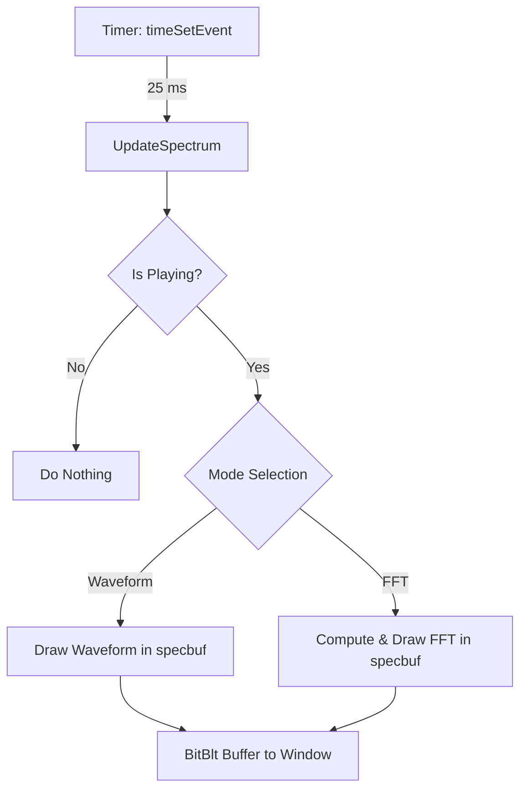

# Visualization Modes and Graphics

## Spectrum Update Loop ⏲️

A high-frequency timer drives real-time updates of the waveform or spectrum. The multimedia timer fires every 25 ms (≈40 Hz), invoking the `UpdateSpectrum` callback to refresh the display .

### Timer Initialization

```cpp
// Set up a periodic 40 Hz timer for spectrum updates
global_timer_updatespectrum = timeSetEvent(
    25,      // delay in ms
    25,      // resolution in ms
    (LPTIMECALLBACK)&UpdateSpectrum,
    0,
    TIME_PERIODIC
);
```

- **Interval**: 25 ms
- **Resolution**: 25 ms
- **Mode**: `TIME_PERIODIC`
- **Callback**: `UpdateSpectrum`

---

## CreateBitmapToDrawSpectrum 🖼️

Allocates a 24-bit DIB section as the off-screen drawing surface. The pixel buffer (`specbuf`) maps directly to the bitmap’s memory for ultra-fast writes .

| Step | Description |
| --- | --- |
| global_skip_updatespectrum | Prevents race conditions during bitmap re-creation |
| Sleep(25) | Ensures any pending `UpdateSpectrum` calls finish |
| Delete old DC and bitmap | Releases previous `specdc` and `specbmp` |
| Prepare `BITMAPINFOHEADER` |  |


```cpp
bh->biSize = sizeof(*bh);
bh->biWidth = SPECWIDTH;
bh->biHeight = SPECHEIGHT;   // inverted (line 0 = bottom)
bh->biSizeImage = SPECWIDTH * SPECHEIGHT * 3;
bh->biPlanes = 1;
bh->biCompression = BI_RGB;
bh->biBitCount = 24;
bh->biClrUsed = bh->biClrImportant = 0;
```

| Create DIBSection |
| --- |


```cpp
specbmp = CreateDIBSection(
    0, (BITMAPINFO*)bh, DIB_RGB_COLORS,
    (void**)&specbuf, NULL, 0
);
specdc  = CreateCompatibleDC(0);
SelectObject(specdc, specbmp);
```

| Resume updates | Clears `global_skip_updatespectrum` and sets a 5 s fallback timer |
| --- | --- |


---

## Dimensions & Resizing 📐

`SPECWIDTH` and `SPECHEIGHT` adapt to the window’s client area. They are set in both `WM_CREATE` and `WM_SIZE` handlers:

```cpp
// On WM_CREATE
SPECWIDTH  = global_xwidth - (global_xwidth % 4);
SPECHEIGHT = global_yheight;
CreateBitmapToDrawSpectrum();
```

- **Alignment**: Width rounded down to a multiple of 4
- **Recreation**: Triggers off-screen bitmap reallocation

---

## UpdateSpectrum Callback 🔄

```cpp
void CALLBACK UpdateSpectrum(
    UINT uTimerID, UINT uMsg,
    DWORD dwUser, DWORD dw1, DWORD dw2
) {
    if (global_skip_updatespectrum) return;
    if (BASS_ChannelIsActive(global_chan) == BASS_ACTIVE_PLAYING) {
        // Choose between waveform or FFT modes
        if (specmode == 3) {
            // Waveform rendering...
        } else {
            // FFT-based spectrum...
        }
        // Blit off-screen buffer to screen
        HDC dc = GetDC(global_hwnd);
        BitBlt(dc, 0, 0, SPECWIDTH, SPECHEIGHT, specdc, 0, 0, SRCCOPY);
        ReleaseDC(global_hwnd, dc);
    }
}
```

- **Skip Flag**: `global_skip_updatespectrum` avoids buffer contention
- **Playback Check**: Ensures stream is playing before drawing
- **Double Buffering**: Writes into `specbuf`, then uses `BitBlt`

---

## Rendering Logic 🎨

1. **Waveform Mode** (`specmode == 3`)
2. Retrieve float samples via `BASS_ChannelGetData`
3. Map and interpolate sample values to pixel rows
4. Draw lines for each audio channel, alternating palette entries

1. **FFT Modes** (`specmode != 3`)
2. Use `BASS_DATA_FFT2048` or `BASS_DATA_FFT4096` based on `SPECWIDTH`
3. Scale amplitudes (sqrt for visibility) to pixel heights
4. Render vertical bars or specialized “3D” markers

---

## Flow of Operations



---

**Key Functions & Buffers**

| Component | Purpose |
| --- | --- |
| **timeSetEvent** | Schedules periodic spectrum updates |
| **UpdateSpectrum** | Fills the DIB buffer with waveform or spectrum data |
| **CreateBitmapToDrawSpectrum** | Allocates 24-bit DIB section and prepares `specbuf` |
| **specbuf** (`BYTE*`) | Direct pointer to bitmap bits for pixel-level drawing |
| **specdc** (`HDC`) | Device context for off-screen drawing |
| **specbmp** (`HBITMAP`) | Off-screen bitmap selected into `specdc` |
| **BitBlt** | Transfers off-screen buffer to the window surface |


This loop underpins all visualization modes, enabling responsive, high-quality audio rendering over a JPEG background.